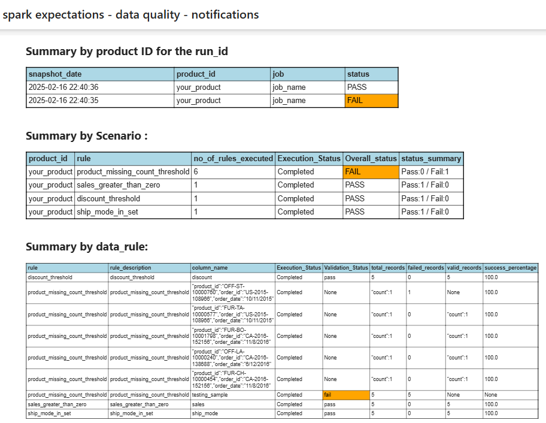

# Spark Expectations Observability Features

## Overview

This document provides an overview of the observability features available in Spark for data quality (DQ) checks using Delta Lake. Observability in this context refers to the ability to monitor, measure, and understand the state and performance of data quality rules applied to datasets.

## Required Attributes for Enabling Observability in Sample DQ Delta

To enable observability in a sample DQ Delta setup, the following attributes are required:

```python
    user_config.se_enable_obs_dq_report_result: True,
    user_config.se_dq_obs_alert_flag: True,
    user_config.se_dq_obs_default_email_template: ""
    #also user need to pass the smtp details for sending mail.
    user_config.se_notifications_email_smtp_host: "smtp.######.com",
    user_config.se_notifications_email_smtp_port: 587,
    user_config.se_notifications_email_from: "a*****.obs@nike.com",
    user_config.se_notifications_email_to_other_mail_id: "abc@mail.com"
    user_config.se_notifications_smtp_password: "************"
```


## Currently our observability system supports 2 flows:
### *Flow 1: DQ Report Generation*
When the DQ report flag is enabled (true), the system generates a report table upon the successful completion of Spark expectations. This flow focuses solely on report generation without triggering any alerts.

---

### *Flow 2: DQ Report Generation with Email Alerts*
When both the DQ report flag and alert flag are enabled (true), the system performs two actions:
1. Generates the report table after Spark expectations are completed.
2. Sends an email alert to the user-provided email address, notifying them of the results.

---

### *Key Highlights:*
- *Flow 1:* Report generation only (DQ flag = true).
- *Flow 2:* Report generation + email alerts (DQ flag = true, Alert flag = true).
- We don't need to create any report table it will be autogenerated along with the flow.

The *report table* is derived from the *Query DQ Output Table* and the *Detailed Table. 
It is designed to calculate key metrics, numerical summaries, and other analytical insights. To ensure consistency and accuracy in the report table, users must adhere to predefined standards when writing queries for the **Query DQ Output Table*.
Below is the example of how the rules we can configure-
```python
RULES_DATA= """
("your_product", "dq_spark_dev.customer_order", "row_dq", "sales_greater_than_zero", "sales", "sales > 2", "ignore", "accuracy", "sales value should be greater than zero", false, true, true, false, 0,null, null, "medium")    ,("your_product", "dq_spark_{env}.customer_order", "row_dq", "discount_threshold", "discount", "discount*100 < 60","drop", "validity", "discount should be less than 40", true, true, true, false, 0,null, null, "medium")
,("your_product", "dq_spark_{env}.customer_order", "row_dq", "ship_mode_in_set", "ship_mode", "lower(trim(ship_mode)) in('second class', 'standard class', 'standard class')", "drop", "validity", "ship_mode mode belongs in the sets", true, true, true, false, 0,null, null, "medium")
,("your_product", "dq_spark_{env}.customer_order", "row_dq", "profit_threshold", "profit", "profit>0", "ignore", "validity", "profit threshold should be greater tahn 0", false, true, false, true, 0,null, null, "medium")
,("your_product", "dq_spark_dev.customer_order", "query_dq", "product_missing_count_threshold", "column_name", "((select count(*) from ({source_f1}) a) - (select count(*) from ({target_f1}) b) ) > 3@source_f1@SELECT DISTINCT product_id, order_id, order_date, COUNT(*) AS count FROM order_source GROUP BY product_id, order_id, order_date@target_f1@SELECT DISTINCT product_id, order_id, order_date, COUNT(*) AS count FROM order_target GROUP BY product_id, order_id, order_date", "ignore", "validity", "row count threshold", true, false, true, false, 0,null, true, "medium")
"""
```

### *Template Options for Report Table Rendering*
Users have two options for generating the report table:

1. *Custom Template:*
   - If the user provides a custom template through the specified attribute, the system will use this template to render the report table.
   - `user_config.se_dq_obs_default_email_template: ""`

2. *Default Jinja Template:*
   - If no custom template is provided by the user, the system will automatically fall back to the default jinja template ([spark_expectations/config/templates/advanced_email_alert_template.jinja](../spark_expectations/config/templates/advanced_email_alert_template.jinja)) for rendering the report table.

### *Sample for the alert received in the mail*

