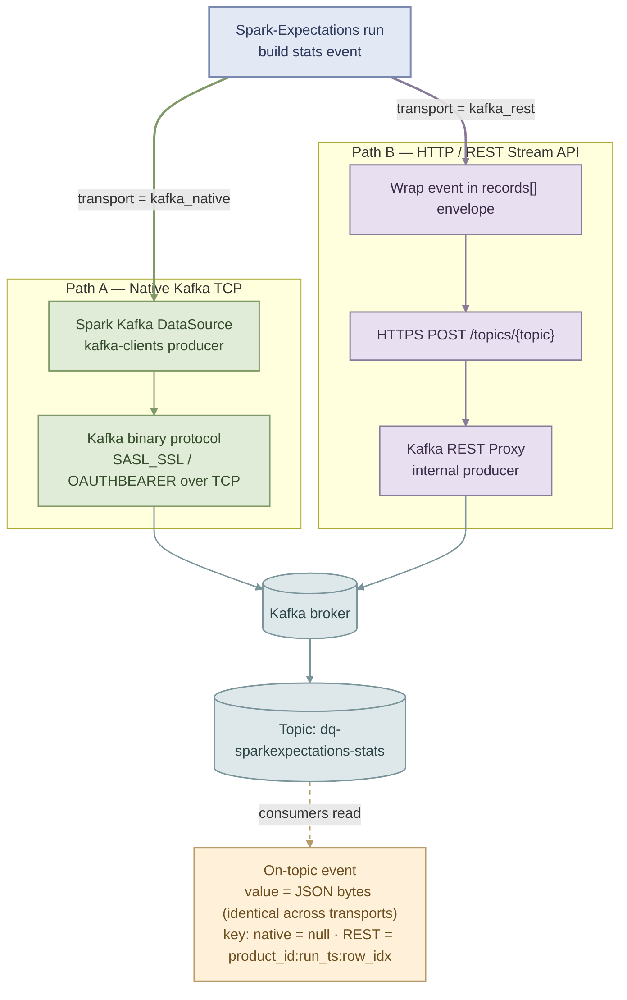

# Metric Events

At the end of every data-quality run, Spark-Expectations emits a **metric event** — a single JSON document that captures the outcome of that run (input / error / output counts, per-rule results, timings, environment, run identifiers, and job metadata). The same document that is written to the `_stats` table is also published as an **event** to a Kafka topic so downstream services can react in real time.

Metric events are the streaming, real-time counterpart of the stats table. They power dashboards, alerting, and dedicated consumers such as the NSP data-quality consumer.

!!! tip "One event per run"
    A metric event is emitted **once per decorated function call**, not per row and not per rule. Row-level failures still land in the `_error` table; the event summarises the run so consumers do not need to scan Delta tables to react.

!!! info "Enabled by `se_enable_streaming`"
    Publishing is controlled by [`user_config.se_enable_streaming`](../user_guide/configuration_reference.md#streaming-kafka). When `False`, no events are produced (status = `Disabled`) and neither transport is invoked. When `True`, exactly one event per run is published to the topic named `dq-sparkexpectations-stats` by default (see [Kafka Streaming Config](../user_guide/user_config/kafka_custom_config.md) for local / custom overrides).

---

## Two Ways to Publish to Kafka

Spark-Expectations supports **two transports** for publishing metric events. Both land the **same bytes** on the same topic — consumers cannot tell them apart — so the choice is driven purely by the network and runtime environment where SE runs.

- **Native Kafka (TCP)** &nbsp;·&nbsp; the Spark Kafka DataSource + `kafka-clients` producer, using the Kafka binary protocol over TCP with SASL/OAUTHBEARER.
- **HTTP / REST Stream API** &nbsp;·&nbsp; a thin HTTPS `POST` to a Kafka REST Proxy that wraps the event in a `records[]` envelope and forwards it to the broker.



The transport is selected via `user_config.se_streaming_transport` (default: **`kafka_native`**). Both paths reuse `to_json(struct(*))` to serialise the event — and both apply the same `se_job_metadata` struct conversion beforehand — so the **`value` bytes are identical** across the two transports. The record **key** differs by transport (see [Key & Partitioning](#key--partitioning) below).

---

## Choosing a Transport

<div class="grid cards" markdown>

-   :material-lan-connect:{ .lg .middle } &nbsp;__Native Kafka (TCP)__

    ---

    **Transport** &nbsp;·&nbsp; Kafka binary protocol over TCP :material-arrow-right: broker `:9092/:9093`
    **Endpoint** &nbsp;·&nbsp; `kafka.bootstrap.servers` (broker list)
    **Client requirement** &nbsp;·&nbsp; JVM + Spark Kafka connector JARs
    **Auth** &nbsp;·&nbsp; SASL_SSL / OAUTHBEARER negotiated at the broker
    **Best for** &nbsp;·&nbsp; in-Spark / Databricks runs with broker connectivity and high event volume; executor-parallel produce with native batching and idempotent producer guarantees.

-   :material-web:{ .lg .middle } &nbsp;__HTTP / REST Stream API__

    ---

    **Transport** &nbsp;·&nbsp; HTTPS `POST` :material-arrow-right: Confluent REST Proxy :material-arrow-right: broker
    **Endpoint** &nbsp;·&nbsp; `POST /topics/{topic}` (Confluent REST Proxy v2)
    **Payload** &nbsp;·&nbsp; JSON only (`embedded_format: json`, `api_version: v2`)
    **Client requirement** &nbsp;·&nbsp; any HTTP client — no Kafka client libraries needed
    **Auth** &nbsp;·&nbsp; HTTP layer to the proxy (Basic / Bearer); proxy holds broker credentials
    **Best for** &nbsp;·&nbsp; restricted-network / non-JVM contexts, or a single governed HTTPS egress.

</div>

!!! note "Future — Confluent v3 / binary / Schema Registry"
    The REST writer is intentionally scoped to the **Confluent v2 Produce API with JSON embedded format** today. `_normalize_api_version` and `_normalize_embedded_format` in [`kafka_rest_writer.py`](https://github.com/Nike-Inc/spark-expectations/blob/main/spark_expectations/sinks/plugins/kafka_rest_writer.py) explicitly reject anything else so misconfiguration fails loudly rather than silently degrading to a different transport. The following are on the roadmap but **not yet implemented** — do not set these config values today:

    - `api_version: "v3"` — Confluent v3 Produce API (`/kafka/v3/clusters/{id}/topics/{topic}/records`). Requires a new `cluster_id` config, a different request envelope (`{"value": {"type": "JSON", "data": {...}}}`), and a different response shape.
    - `embedded_format: "binary"` — base64-encoded JSON bytes on the wire.
    - Schema Registry integration (`value_schema` / `value_schema_id`) — Avro / Protobuf / JSON-Schema-validated payloads.

---

## Connecting

Both transports are configured through the same `user_conf` dict passed to `SparkExpectations(...)`. Base URL, topic, and credentials resolve **secret-scope-first** (Databricks or Cerberus), with a direct-config fallback for local use.

=== "Native (TCP)"

    ```python
    from spark_expectations.config.user_config import Constants as user_config

    user_conf = {
        user_config.se_enable_streaming: True,
        # user_config.se_streaming_transport: "kafka_native",  # default; can be omitted
        user_config.secret_type: "databricks",
        user_config.dbx_workspace_url: "https://nike-sole-us-east-1.cloud.databricks.com",
        user_config.dbx_secret_scope: "sole_common_prod",
        user_config.dbx_kafka_server_url: "se_streaming_server_url_secret_key",
        user_config.dbx_topic_name: "se_streaming_topic_name",
        user_config.dbx_secret_token_url: "se_streaming_auth_secret_token_url_key",
        user_config.dbx_secret_app_name: "se_streaming_auth_secret_appid_key",
        user_config.dbx_secret_token: "se_streaming_auth_secret_token_key",
    }
    ```

    Under the hood SE runs the equivalent of:

    ```python
    df.selectExpr("to_json(struct(*)) AS value") \
      .write.format("kafka") \
      .options(
          **{
              "kafka.bootstrap.servers": "<bootstrap-servers>",
              "topic": "dq-sparkexpectations-stats",
              "kafka.security.protocol": "SASL_SSL",
              "kafka.sasl.mechanism": "OAUTHBEARER",
          }
      ).save()
    ```

    !!! note "Native has no `curl` equivalent"
        The Kafka binary protocol is not HTTP; the closest CLI analog is `kafka-console-producer --bootstrap-server ...`.

=== "REST (HTTP)"

    ```python
    from spark_expectations.config.user_config import Constants as user_config

    user_conf = {
        user_config.se_enable_streaming: True,
        user_config.se_streaming_transport: "kafka_rest",        # explicit opt-in
        user_config.se_streaming_rest_base_url: "https://kafka-rest.example.nike.com",
        user_config.se_streaming_rest_topic_name: "dq-sparkexpectations-stats",
        user_config.se_streaming_rest_embedded_format: "json",   # only "json" is supported today
        user_config.se_streaming_rest_api_version: "v2",         # only "v2" is supported today
        user_config.se_streaming_rest_auth_type: "none",         # none | basic | bearer
    }
    ```

    Reproduce the same event with a plain `curl` (v2, JSON embedded format):

    ```bash
    curl -sS -X POST \
      "https://kafka-rest.example.nike.com/topics/dq-sparkexpectations-stats" \
      -H "Content-Type: application/vnd.kafka.json.v2+json" \
      -H "Accept: application/vnd.kafka.v2+json" \
      -d '{
        "records": [
          {
            "value": {
              "product_id": "data_quality",
              "table_name": "employee_table",
              "input_count": 100,
              "error_count": 10,
              "output_count": 90,
              "dq_status": { "run_status": "Passed" },
              "meta_dq_run_id": "product1_run_test",
              "dq_env": "PROD"
            }
          }
        ]
      }'
    ```

    !!! warning "Per-record `error_code` guard"
        The Confluent REST Proxy can return **HTTP 200 while individual records fail** with a per-record `error_code` inside the `offsets[]` array (and, in some responses, at the top level). SE's REST sink inspects every `offsets[].error_code` — as well as the top-level `error_code` — and raises `SparkExpectationsMiscException` on any failure so silent data loss cannot occur. This applies to the v2 response shape SE targets today; when v3 support lands (see the "Future" note above), the same guard extends to its per-record error semantics.

---

## The Metric Event Payload

Each event is a single flat JSON document. The Kafka record has no headers and `value` set to the UTF-8 JSON bytes below — identical across transports. The record `key` is transport-specific: **`null` on native**, and **`{product_id}:{run_timestamp_iso}:{row_index}`** on REST (needed for compacted topics; see [Key & Partitioning](#key--partitioning)).

!!! example "Sample metric event"
    ```json
    {
      "product_id": "data_quality",
      "table_name": "employee_table",
      "input_count": 100,
      "error_count": 10,
      "output_count": 90,
      "output_percentage": 90.0,
      "success_percentage": 90.0,
      "error_percentage": 10.0,
      "source_agg_dq_results": null,
      "final_agg_dq_results": null,
      "source_query_dq_results": null,
      "final_query_dq_results": null,
      "row_dq_res_summary": [
        {
          "rule": "sales_greater_than_zero",
          "rule_type": "row_dq",
          "column_name": "sales",
          "failed_row_count": "1",
          "tag": "validity",
          "action_if_failed": "drop",
          "description": "sales value should be greater than zero"
        }
      ],
      "row_dq_error_threshold": [
        {
          "rule_name": "sales_greater_than_zero",
          "column_name": "sales",
          "rule_type": "row_dq",
          "action_if_failed": "drop",
          "description": "sales value should be greater than zero",
          "error_drop_threshold": "0",
          "error_drop_percentage": "1.0"
        }
      ],
      "dq_status": {
        "run_status": "Passed",
        "row_dq": "Passed",
        "source_agg_dq": "Passed",
        "final_agg_dq": "Passed",
        "source_query_dq": "Passed",
        "final_query_dq": "Passed"
      },
      "dq_run_time": {
        "run_time": 12.5,
        "row_dq_run_time": 8.2,
        "source_agg_dq_run_time": 0.0,
        "source_query_dq_run_time": 0.0,
        "final_agg_dq_run_time": 0.0,
        "final_query_dq_run_time": 0.0
      },
      "dq_rules": {
        "rules": { "num_row_dq_rules": 3, "num_dq_rules": 5 },
        "agg_dq_rules": {
          "num_agg_dq_rules": 1,
          "num_source_agg_dq_rules": 1,
          "num_final_agg_dq_rules": 0
        },
        "query_dq_rules": {
          "num_query_dq_rules": 1,
          "num_source_query_dq_rules": 1,
          "num_final_query_dq_rules": 0
        }
      },
      "meta_dq_run_id": "product1_run_test",
      "meta_dq_run_date": "2026-09-10",
      "meta_dq_run_datetime": "2026-09-10T14:30:00.000Z",
      "dq_env": "PROD",
      "se_job_metadata": {
        "runtime_env": { "host": "nike-sole-us-east-1.cloud.databricks.com" }
      }
    }
    ```

    The exact stats-row shape is built in `SparkExpectationsWriter.write_error_stats` in [`spark_expectations/sinks/utils/writer.py`](https://github.com/Nike-Inc/spark-expectations/blob/main/spark_expectations/sinks/utils/writer.py); the on-topic bytes are the `to_json(struct(*))` projection of that row.

`se_job_metadata` is converted from a JSON string to a nested struct **before** the `to_json(struct(*))` projection, so it appears as a real nested object (not a double-escaped string) in the event. Both transports call the same [`apply_se_job_metadata_struct`](https://github.com/Nike-Inc/spark-expectations/blob/main/spark_expectations/sinks/utils/stats_metadata.py) helper, which guarantees the **`value` bytes are identical** across `kafka_native` and `kafka_rest`.

**On-topic guarantees:**

- [x] `value` is `to_json(struct(*))` UTF-8 bytes — no schema-registry magic byte — **identical across transports**
- [x] No Kafka headers are attached — same on both transports
- [x] Consumers that read only `value` (e.g. the NSP data-quality consumer) work unchanged when the transport changes

### Key & Partitioning

The record `key` and resulting partitioning differ by transport. This is intentional — the REST path must key every record so it can produce to topics with `cleanup.policy=compact`, which the Confluent REST Proxy rejects when `key` is null.

| Transport | `key` | Partitioning |
|---|---|---|
| `kafka_native` | `null` (only the `value` column is projected before `.write.format("kafka")`) | Round-robin across partitions |
| `kafka_rest` | `"{product_id}:{run_timestamp_iso}:{row_index}"` — built once per publish in [`_build_record_key`](https://github.com/Nike-Inc/spark-expectations/blob/main/spark_expectations/sinks/plugins/kafka_rest_writer.py); `run_timestamp_iso` is the UTC ISO-8601 timestamp captured at the start of the publish | Hash of the key by the broker |

**Consumer impact** — consumers that parse only `value` are unaffected. Consumers or downstream tooling that rely on `key == null` (e.g. for round-robin fan-out) or on a stable key format will see different behavior on the REST path.

---

??? abstract "Detailed transport comparison"

    | Dimension | Native Kafka (TCP) | HTTP / REST Stream API |
    |---|---|---|
    | Transport | Kafka binary protocol over TCP | HTTP/HTTPS + JSON |
    | Endpoint | `kafka.bootstrap.servers` (broker list) | `POST /topics/{topic}` (Confluent REST Proxy v2) |
    | Client requirement | JVM + Spark Kafka connector JARs | Any HTTP client (curl, `requests`, browser) |
    | Auth | SASL_SSL + OAUTHBEARER to the broker | HTTP auth to the proxy; proxy holds broker credentials |
    | Message envelope | Spark columns `key` / `value` / `partition` / `headers` (only `value` is projected → key is `null`) | JSON `{ "records": [ { "key": "...", "value": {...} } ] }` (v2) — key always populated |
    | Value encoding | Raw UTF-8 bytes of the JSON string | JSON object (v2 `embedded_format=json`) |
    | Schema Registry | Not used | Not used (JSON-only pipeline; no schema id / subject registration) |
    | Response semantics | Spark task success / failure | HTTP status + per-record `offsets[].error_code` |
    | Throughput profile | High — executor-parallel, native batching, compression | Lower per call; single HTTPS request per event on the driver |
    | Delivery guarantees | Idempotent producer, `acks`, retries, transactions | HTTP + per-record `error_code` check (proxy can 200 with record failures) |
    | Ops footprint | Brokers only | Extra REST Proxy tier to run, scale, secure, monitor |
    | Network reach | Every executor :material-arrow-right: every broker leader | Single HTTPS endpoint |
    | Ordering | Per-partition | Per-partition (proxy) — pin via `/partitions/{id}` if strict |
    | Compaction (`cleanup.policy=compact`) | Not supported — null key is rejected by compacted topics | Supported — key is always populated |
    | Partitioning | Round-robin (null key) | Hash of `{product_id}:{run_timestamp_iso}:{row_index}` |

    **Rule of thumb** — use **Native** when SE runs inside Spark/Databricks with broker connectivity and event volume matters; use **REST** when broker connectivity is not available/allowed, when a thin/non-JVM client must publish, or when a single governed HTTPS egress is a hard requirement.

---

## Related

- [Kafka Streaming Config](../user_guide/user_config/kafka_custom_config.md) — local and custom-config setup for the streaming topic and bootstrap server
- [Data Quality Metrics](../user_guide/data_quality_metrics.md) — schema of the `_stats` table (same fields as the metric event)
- [Configuration Reference](../user_guide/configuration_reference.md#streaming-kafka) — the full list of `se_streaming_*` config keys
- [Secrets Backend](../user_guide/secrets_backend.md) — how base URL, topic, and credentials resolve from Databricks or Cerberus secret scopes
