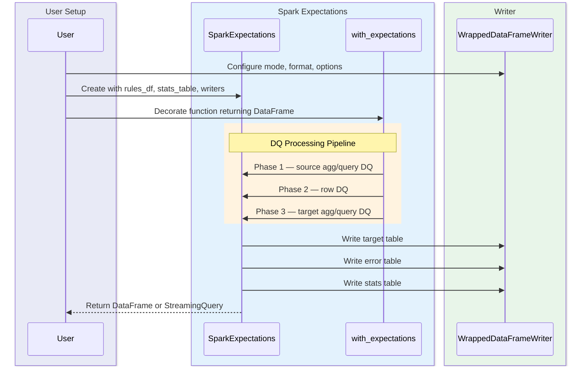

# Welcome to Spark-Expectations

Spark-Expectations is a data quality framework built in PySpark. It runs data quality rules **in-flight** using a decorator pattern while your Spark job is processing data, and can also validate data at rest.

## How It Works

## Architecture

| Plugin Category | Implementations |
|---|---|
| **Sink Plugins** | Kafka Writer |
| **Notification Plugins** | Email, Slack, Teams, Zoom, PagerDuty |
| **Secret Plugins** | Cerberus, Databricks Secrets |
| **Rule Loader Plugins** | YAML Loader, JSON Loader, Spark Table |

All plugin categories use [pluggy](https://pluggy.readthedocs.io/) and can be extended with custom implementations.

## Features

### Rules

Rules define your data quality expectations. Three rule types are supported:

- **`row_dq`** -- Row-level checks (e.g., `age IS NOT NULL`, `amount > 0`)
- **`agg_dq`** -- Aggregate checks (e.g., `count(*) > 0`, `avg(score) > 80`)
- **`query_dq`** -- SQL query-based checks for cross-table or complex validations

Rules can be stored in a **Spark table** or defined in **YAML/JSON files** for version-controlled, PR-reviewable data quality.

Proceed to [Data Quality Rules](user_guide/data_quality_rules.md) for details on how rules can be configured.

### Output Tables

Spark Expectations creates multiple tables to store the output of each job:

- **Target table** -- Clean data that passed all DQ checks
- **Error table** -- Rows that failed one or more DQ rules, with metadata about which rules failed
- **Stats table** -- Aggregated metrics for each run (input/output/error counts, rule results, timings)
- **Detailed stats table** (optional) -- Per-rule execution results
- **Query DQ output table** (optional) -- Results from custom query DQ checks

Check [Data Quality Metrics](user_guide/data_quality_metrics.md) for schema details.

### Notifications

Notifications can be sent at different stages of the DQ run (start, completion, failure, threshold breach). Supported channels:

- [Email](user_guide/notifications/email_notifications.md) (with Jinja template support)
- [Slack](user_guide/notifications/slack_notifications.md)
- [Microsoft Teams](user_guide/notifications/teams_notifications.md)
- [Zoom](user_guide/notifications/zoom_notifications.md)
- [PagerDuty](user_guide/notifications/pagerduty_notifications.md)

### Integrations

Write to any Spark-supported data store:

- **Delta Lake** -- [Example](delta.md)
- **BigQuery** -- [Example](bigquery.md)
- **Apache Iceberg** -- [Example](iceberg.md)

Both **batch** and **streaming** DataFrames are supported via `WrappedDataFrameWriter` and `WrappedDataFrameStreamWriter`.
