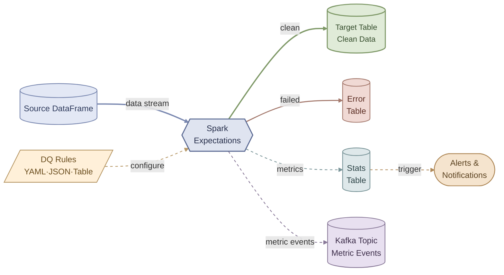
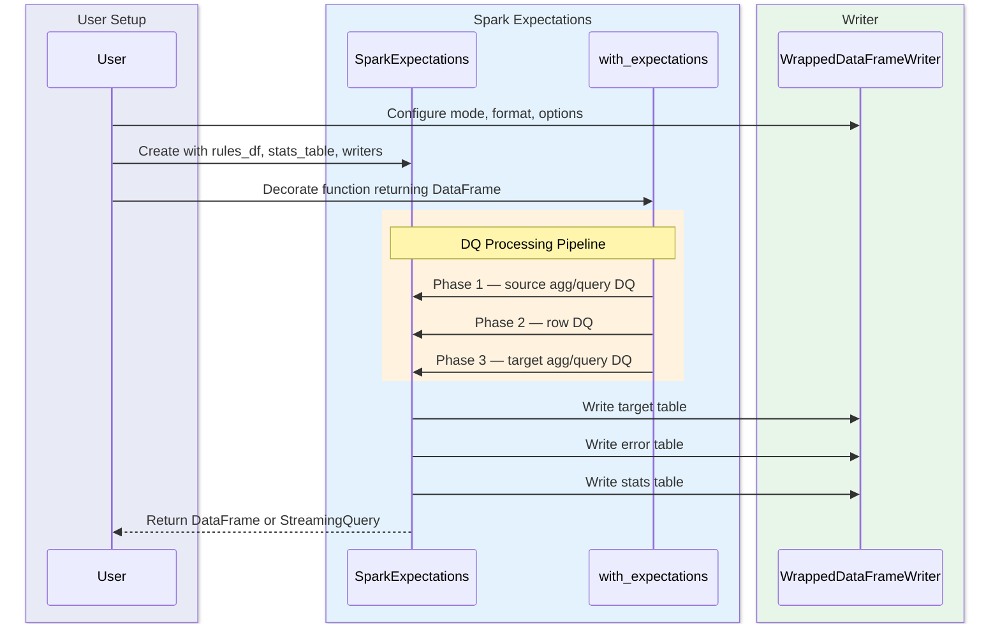

# Welcome to Spark-Expectations

Spark-Expectations is an open-source, PySpark-native data quality framework delivered as a Python library. It enforces expectation rules in-flight via decorators as pipelines run—quarantining failures, passing clean data downstream, and emitting metrics and alerts—or validates tables at rest.

## Data Flow at a Glance

```mermaid
flowchart LR
    Source[("Source DataFrame")]:::src
    Rules[/"DQ Rules<br/>YAML·JSON·Table"/]:::cfg
    Filter{{"Spark<br/>Expectations"}}:::filt
    Target[("&nbsp;&nbsp;Target Table&nbsp;&nbsp;<br/>Clean Data")]:::good
    Error[("Error<br/>Table")]:::bad
    Stats[("Stats<br/>Table")]:::obs
    Kafka[("Kafka Topic<br/>Metric Events")]:::kafka
    Alerts(["Alerts &<br/>Notifications"]):::alrt

    Source ==>|"data stream"| Filter ==>|"clean"| Target
    Rules -.->|"configure"| Filter
    Filter ==>|"failed"| Error
    Filter -.->|"metrics"| Stats
    Filter -.->|"metric events"| Kafka
    Stats -.->|"trigger"| Alerts

    classDef src fill:#E3E8F5,stroke:#7A88B0,color:#2E3A5C,stroke-width:1.5px
    classDef cfg fill:#FFF0D9,stroke:#B89968,color:#6B4E1F,stroke-width:1.5px
    classDef filt fill:#DFE4F0,stroke:#5C6B94,color:#262E4A,stroke-width:2px
    classDef good fill:#E0EBD8,stroke:#7F9968,color:#354D2C,stroke-width:2px,font-size:15px
    classDef bad fill:#F0D9D4,stroke:#A57A6E,color:#5C2E24,stroke-width:1.5px
    classDef obs fill:#DEE8EA,stroke:#7A9599,color:#2E4548,stroke-width:1.5px
    classDef kafka fill:#E8E0F0,stroke:#8A7A99,color:#3D2E4A,stroke-width:1.5px
    classDef alrt fill:#F5E4CE,stroke:#B08A5A,color:#5C4321,stroke-width:1.5px

    linkStyle 0 stroke:#7A88B0,stroke-width:2.5px
    linkStyle 1 stroke:#7F9968,stroke-width:2.5px
    linkStyle 2 stroke:#B89968,stroke-width:1.5px,stroke-dasharray:5 5
    linkStyle 3 stroke:#A57A6E,stroke-width:2px
    linkStyle 4 stroke:#7A9599,stroke-width:1.5px,stroke-dasharray:5 5
    linkStyle 5 stroke:#8A7A99,stroke-width:1.5px,stroke-dasharray:5 5
    linkStyle 6 stroke:#B08A5A,stroke-width:1.5px,stroke-dasharray:5 5
```

When `se_enable_streaming` is enabled, the same run-level metrics written to the stats table are also published as JSON events to a Kafka topic (see [Streaming / Kafka](user_guide/configuration_reference.md#streaming--kafka)).

## How It Works

```mermaid
sequenceDiagram
    box rgb(232, 234, 246) User Setup
    participant User
    end
    box rgb(227, 242, 253) Spark Expectations
    participant SE as SparkExpectations
    participant Decorator as with_expectations
    end
    box rgb(232, 245, 233) Writer
    participant Writer as WrappedDataFrameWriter
    end

    User->>Writer: Configure mode, format, options
    User->>SE: Create with rules_df, stats_table, writers
    User->>Decorator: Decorate function returning DataFrame
    rect rgb(255, 243, 224)
    Note over Decorator, SE: DQ Processing Pipeline
    Decorator->>SE: Phase 1 — source agg/query DQ
    Decorator->>SE: Phase 2 — row DQ
    Decorator->>SE: Phase 3 — target agg/query DQ
    end
    SE->>Writer: Write target table
    SE->>Writer: Write error table
    SE->>Writer: Write stats table
    SE-->>User: Return DataFrame or StreamingQuery
```

## Architecture

| Plugin Category          | Implementations                       |
| ------------------------ | ------------------------------------- |
| **Sink Plugins**         | Kafka Writer                          |
| **Notification Plugins** | Email, Slack, Teams, Zoom, PagerDuty  |
| **Secret Plugins**       | Cerberus, Databricks Secrets          |
| **Rule Loader Plugins**  | YAML Loader, JSON Loader, Spark Table |

All plugin categories use [pluggy](https://pluggy.readthedocs.io/) and can be extended with custom implementations.

## Features

### Rules

Rules configure what the inline DQ filter checks (see [Data Flow at a Glance](#data-flow-at-a-glance)). Three rule types are supported:

- `row_dq` -- Row-level checks (e.g., `age IS NOT NULL`, `amount > 0`)
- `agg_dq` -- Aggregate checks (e.g., `count(*) > 0`, `avg(score) > 80`)
- `query_dq` -- SQL query-based checks for cross-table or complex validations

Rules are typically defined in **YAML or JSON files**, providing version-controlled, PR-reviewable data quality governance. Spark table–based rule storage is also supported.

Proceed to [Data Quality Rules](user_guide/data_quality_rules.md) for details on how rules can be configured.

### Output Tables

Spark Expectations routes pipeline output to multiple tables at the end of each run (shown in the diagram above):

- **Target table** -- Clean data that passed all DQ checks
- **Error table** -- Rows that failed one or more DQ rules, with metadata about which rules failed
- **Stats table** -- Aggregated metrics for each run (input/output/error counts, rule results, timings)
- **Detailed stats table** (optional) -- Per-rule execution results
- **Query DQ output table** (optional) -- Results from custom query DQ checks

Check [Data Quality Metrics](user_guide/data_quality_metrics.md) for schema details.

### Notifications

Notifications can be sent at different stages of the DQ run (start, completion, failure, threshold breach). Supported channels:

- [Email](user_guide/notifications/email_notifications.md) (with Jinja template support)
- [Slack](user_guide/notifications/slack_notifications.md)
- [Microsoft Teams](user_guide/notifications/teams_notifications.md)
- [Zoom](user_guide/notifications/zoom_notifications.md)
- [PagerDuty](user_guide/notifications/pagerduty_notifications.md)

### Integrations

Write to any Spark-supported data store:

- **Delta Lake** -- [Example](delta.md)
- **BigQuery** -- [Example](bigquery.md)
- **Apache Iceberg** -- [Example](iceberg.md)

Both **batch** and **streaming** DataFrames are supported via `WrappedDataFrameWriter` and `WrappedDataFrameStreamWriter`.