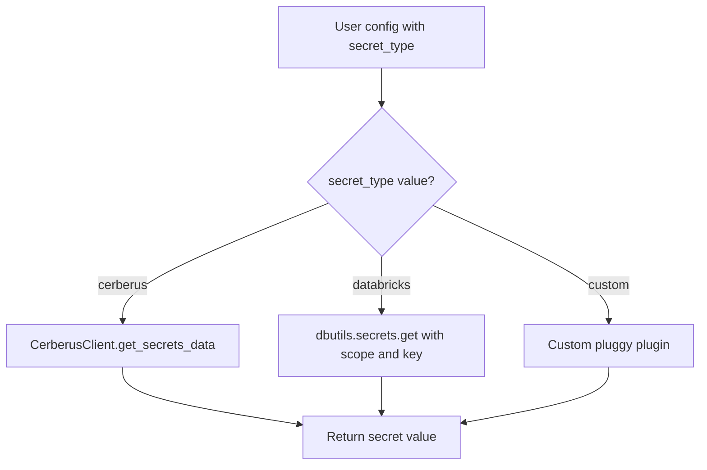

# Secrets Backend

Spark Expectations uses a pluggy-based plugin system to resolve sensitive values (e.g., Kafka authentication tokens, SMTP passwords) from secure secret stores at runtime. Two backends are included out of the box: **Cerberus** and **Databricks Secrets**.

## How It Works



When streaming stats to Kafka is enabled, Spark Expectations needs credentials to authenticate with the Kafka broker. Rather than passing secrets in plain text, you configure a `secret_type` and the corresponding backend-specific keys. The framework then resolves the actual secret values at runtime.

## Configuration

Set the `secret_type` in your `stats_streaming_options` dictionary to choose which backend to use.

### Cerberus

```python
from spark_expectations.config.user_config import Constants as user_config

stats_streaming_config = {
    user_config.se_enable_streaming: True,
    user_config.secret_type: "cerberus",
    user_config.cbs_url: "https://cerberus.example.com",
    user_config.cbs_sdb_path: "app/your-sdb-path",
    user_config.cbs_kafka_server_url: "kafka_server_url_key",
    user_config.cbs_secret_token_url: "auth_token_url_key",
    user_config.cbs_secret_app_name: "auth_app_name_key",
    user_config.cbs_secret_token: "auth_token_key",
    user_config.cbs_topic_name: "topic_name_key",
}
```

| Constant | Description |
|---|---|
| `secret_type` | Must be `"cerberus"` |
| `cbs_url` | Cerberus server URL |
| `cbs_sdb_path` | Secure Data Block path in Cerberus |
| `cbs_kafka_server_url` | Key within the SDB for the Kafka server URL |
| `cbs_secret_token_url` | Key for the authentication token URL |
| `cbs_secret_app_name` | Key for the authentication app name |
| `cbs_secret_token` | Key for the authentication token |
| `cbs_topic_name` | Key for the Kafka topic name |

!!! note
    The `cerberus` Python package must be installed separately. It is not a dependency of spark-expectations.

### Databricks Secrets

```python
from spark_expectations.config.user_config import Constants as user_config

stats_streaming_config = {
    user_config.se_enable_streaming: True,
    user_config.secret_type: "databricks",
    user_config.dbx_workspace_url: "https://workspace.cloud.databricks.com",
    user_config.dbx_secret_scope: "your_secret_scope",
    user_config.dbx_kafka_server_url: "se_streaming_server_url_secret_key",
    user_config.dbx_secret_token_url: "se_streaming_auth_secret_token_url_key",
    user_config.dbx_secret_app_name: "se_streaming_auth_secret_appid_key",
    user_config.dbx_secret_token: "se_streaming_auth_secret_token_key",
    user_config.dbx_topic_name: "se_streaming_topic_name",
}
```

| Constant | Description |
|---|---|
| `secret_type` | Must be `"databricks"` |
| `dbx_workspace_url` | Databricks workspace URL |
| `dbx_secret_scope` | Name of the Databricks secret scope |
| `dbx_kafka_server_url` | Secret key for the Kafka server URL |
| `dbx_secret_token_url` | Secret key for the authentication token URL |
| `dbx_secret_app_name` | Secret key for the authentication app name |
| `dbx_secret_token` | Secret key for the authentication token |
| `dbx_topic_name` | Secret key for the Kafka topic name |

### SMTP Password via Secrets

Secrets backends are also used for SMTP passwords when email notifications require authentication. Configure via `se_notifications_smtp_creds_dict`:

=== "Cerberus"

    ```python
    smtp_creds = {
        user_config.secret_type: "cerberus",
        user_config.cbs_url: "https://cerberus.example.com",
        user_config.cbs_sdb_path: "app/your-sdb-path",
        user_config.cbs_smtp_password: "smtp_password_key",
    }

    user_conf = {
        user_config.se_notifications_smtp_creds_dict: smtp_creds,
    }
    ```

=== "Databricks"

    ```python
    smtp_creds = {
        user_config.secret_type: "databricks",
        user_config.dbx_workspace_url: "https://workspace.cloud.databricks.com",
        user_config.dbx_secret_scope: "your_secret_scope",
        user_config.dbx_smtp_password: "smtp_password_secret_key",
    }

    user_conf = {
        user_config.se_notifications_smtp_creds_dict: smtp_creds,
    }
    ```

## Writing a Custom Secrets Plugin

The secrets system uses [pluggy](https://pluggy.readthedocs.io/). You can register your own backend by implementing the `SparkExpectationsSecretPluginSpec` hook:

```python
import pluggy
from typing import Optional, Dict

SPARK_EXPECTATIONS_SECRETS_BACKEND = "spark_expectations_secrets_backend"
hook_impl = pluggy.HookimplMarker(SPARK_EXPECTATIONS_SECRETS_BACKEND)

class MyCustomSecretPlugin:
    @staticmethod
    @hook_impl
    def get_secret_value(
        secret_key_path: str, secret_dict: Dict[str, str]
    ) -> Optional[str]:
        if secret_dict.get("se.streaming.secret.type", "").lower() == "my_vault":
            # Fetch from your custom vault
            return my_vault_client.get(secret_key_path)
        return None
```

Register it via a setuptools entry point in your package's `pyproject.toml`:

```toml
[project.entry-points."spark_expectations_secrets_backend"]
my_vault = "my_package.secrets:MyCustomSecretPlugin"
```

The plugin manager loads all registered entry points automatically.
